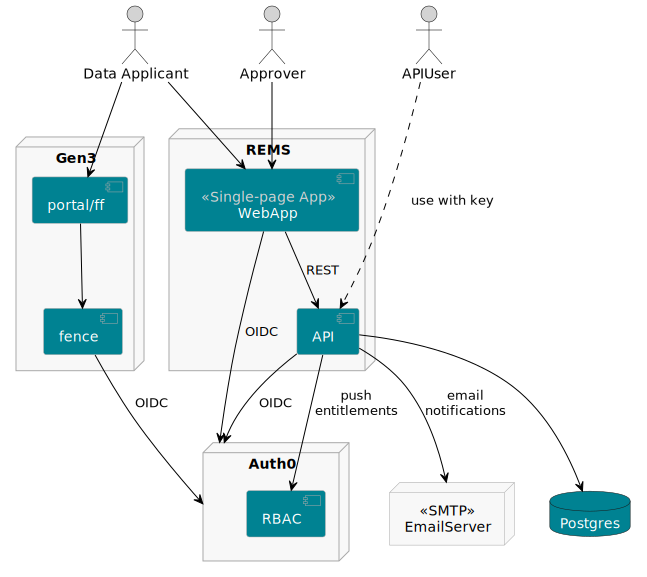
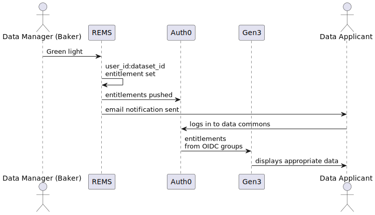

Key happy path story:
* User requests access to a dataset
* Request is reviewed
* Request is approved
* User logs in to Gen3 and has Tier3 access.

Key integration points:
* REMS → Auth0 (REMS entitlements → Auth0 group membership)

Nice-to-have integration points:
* Gen3 → Auth0 (Datasets → auto-gen Auth0 groups)
* Gen3 → REMS (Datasets → auto-gen REMS resources)
* Gen3 → REMS (Gen3 apply for access → pre-populated REMS form)
